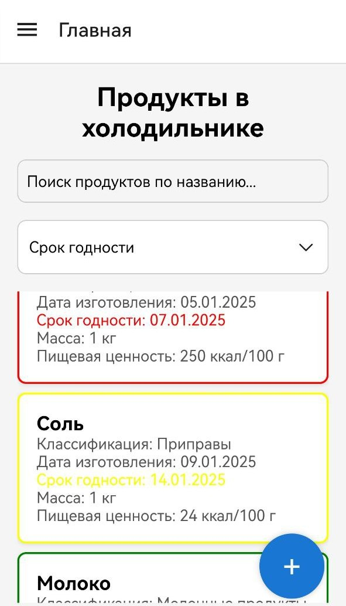
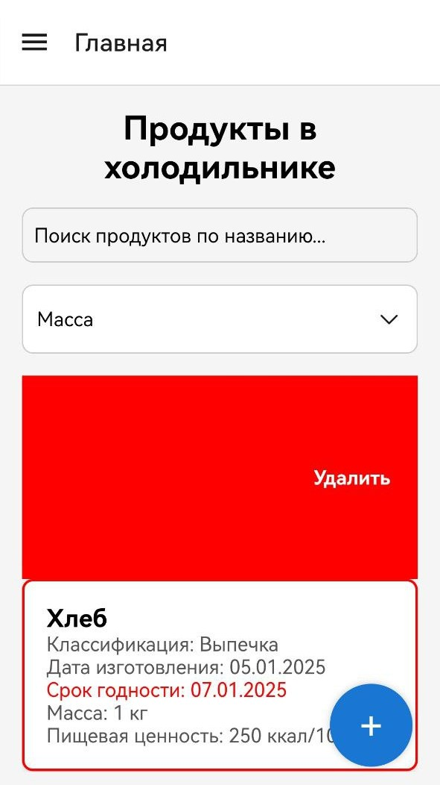
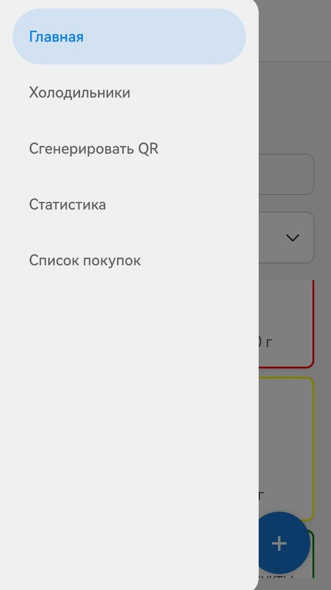
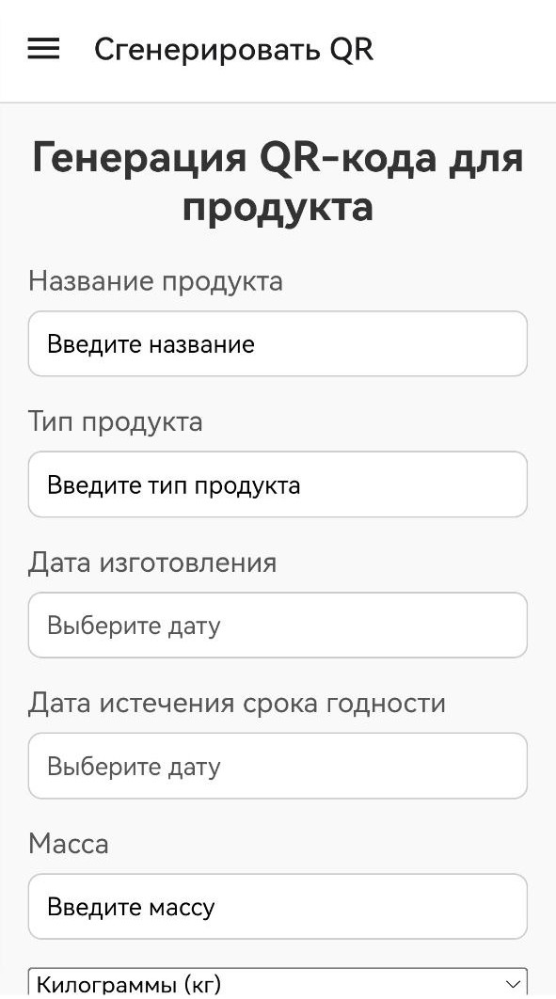
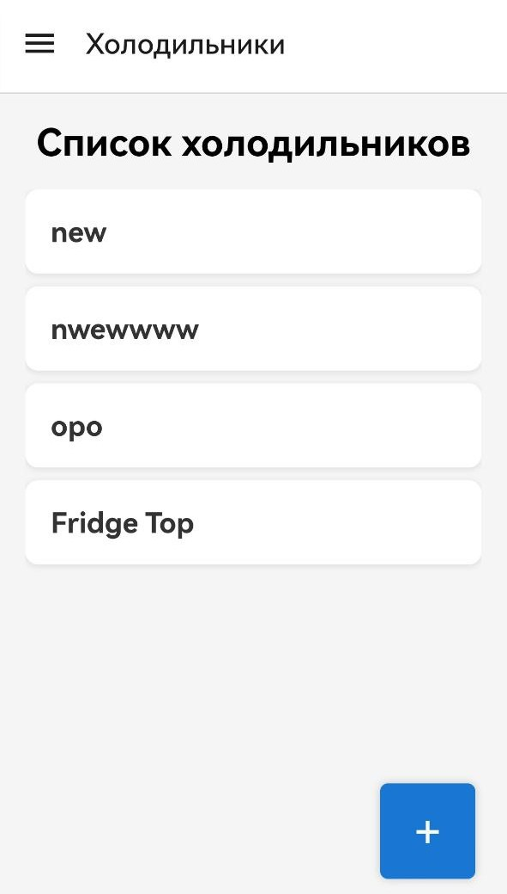
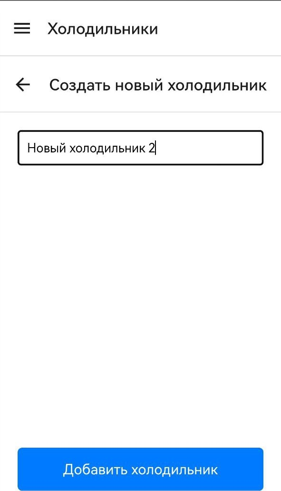
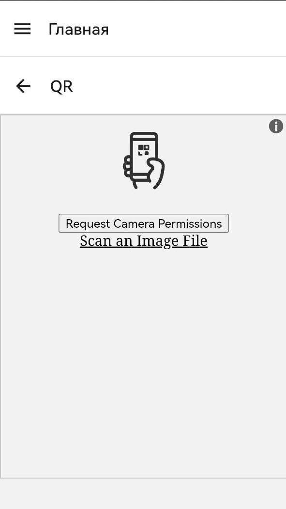
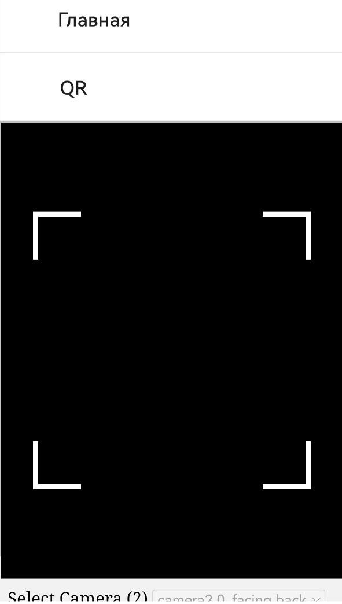

# **SmartFridge**


> [!NOTE]
> Приложение для отслеживания содержимого и проведения инвентаризации
>

## Содержание

1. [О проекте](./README.md#о-проекте)
2. [Описание приложения](./README.md#описание-приложения)
   * [Скриншоты приложения](./README.md#скриншоты-приложения)
3. [Структура репозитория](./README.md#структура-репозитория)
   * [Документация](./README.md#документация)
   * [Backend логика](./README.md#backend-логика)
   * [Frontend логика](./README.md#frontend-логика)
   * [Тестирование](./README.md#тестирование)
   * [Дополнительно](./README.md#дополнительно)
4. [Запуск проекта](./README.md#запуск-проекта)
   * [Запуск сервера](./README.md#запуск-сервера)
   * [Запуск приложения](./README.md#запуск-приложения)
   * [Генерация QR кода](./README.md#генерация-qr-кода)
   * [Запуск и проверка тестов](./README.md#запуск-и-проверка-тестов)
5. [Полезные ссылки](./README.md#полезные-ссылки)

---

<br>

## О проекте

> [!NOTE]
> Юные бизнесмены решили открыть свое собственное кафе, но столкнулись с проблемой: процесс инвентаризации продуктовых запасов в
холодильнике занимал слишком много времени, а закупки продуктов становились неоптимальными, так как невозможно было уследить за актуальным содержимым. 
> Руководством было принято решение разработать приложение для отслеживания содержимого в холодильнике и упрощения процесса ведения инвентаризации.
> Участникам предлагается разработать приложение, которое будет отображать содержимое холодильника на основе данных, считанных с QR-кодов на продуктах, помещаемых в холодильник.
> Приложение должно отображать подробную информацию о продуктах внутри холодильника, выводить аналитику потребления и уведомлять пользователя об истечении сроков годности продуктов.
>


---

<br>

## Описание приложения

Приложение SmartFridge представляет из себя сборку WEB компонентов, написанных с использованием [JavaScript](https://ru.wikipedia.org/wiki/JavaScript) на framework`е React Native.

**React Native** — кроссплатформенный фреймворк с открытым исходным кодом для разработки нативных мобильных и настольных приложений на JavaScript и TypeScript. Создан Facebook, Inc. (Ныне Meta). **И несмотря на это React Native отлично работает с WEB технологиями, так как является ответвлением от основного React**.

Текущая сборка приложения позволяет пользователям отслеживать содержимое *условного холодильника*. 

Почему условного?

Дело в том, что приложение работает и настроено на работу с конкретным устройством (по техническому заданию это холодильник), но работоспособность самого продукта не зависит от него. Следовательно не сложно сделать вывод, что приложение можно использовать для отслеживания содержимого любого устройства, разве что нужно изменить структуру передаваемых результатов.

### Скриншоты приложения

> [!WARNING]
> Реальное приложение может отличаться.
> 
> Все зависит от версии разработки и дате обновления README.md

Главная страница:

<div style="display: flex; justify-content: center;">
  <div style="margin: 10px; text-align: center;">
    
    <p style="font-size: 14px;">Главная</p>
  </div>

  <div style="margin: 10px; text-align: center;">
    
    <p style="font-size: 10px;" >Фильтр по словам <br>(поиск)</p>
  </div>

  <div style="margin: 10px; text-align: center;">
    
    <p style="font-size: 10px;">Функция удаления<br>нужно просто смахнуть</p>
  </div>
</div>


На главной странице происходит основная работа с продуктами, их просмотр и удаление. Можно отфильтровать продукты по названию, что позволяет быстро найти нужный продукт, а так же удалить ненужные продукты с помощью функции смахивания влево.

Навигация:

Для навигации достаточно нажать на иконку "бургер" в левом верхнем углу, после этого появиться меню с возможностями:

<div>
  <div style="margin: 10px; text-align: center;">
    
    <p style="font-size: 10px;">Меню навигации</p>
  </div>
</div>

Другие страницы:

<div style="display: flex; justify-content: center;">
  <div style="margin: 10px; text-align: center;">
    
    <p style="font-size: 10px;">Генерация QR кода (1 часть)</p>
  </div>
  <div style="margin: 10px; text-align: center;">
    
    <p style="font-size: 10px;">Генерация QR кода (2 часть)</p>
  </div>
</div>

<div style="display: flex; justify-content: center;">
  <div style="margin: 10px; text-align: center;">
    
    <p style="font-size: 10px;">Список активных<br>холодильников</p>
  </div>
  <div style="margin: 10px; text-align: center;">
    
    <p style="font-size: 10px;">Создать холодильник</p>
  </div>
</div>

<div style="display: flex; justify-content: center;">
  <div style="margin: 10px; text-align: center;">
    
    <p style="font-size: 10px;">Страница сканирования QR<br>(требуются разрешения)</p>
  </div>
  <div style="margin: 10px; text-align: center;">
    
    <p style="font-size: 10px;">Пример работы QR</p>
  </div>
</div>

---

<br>

## Структура репозитория

Пускай хранить всю информацию о проекте в одном репозитории не очень эстетично, да и не слишком удобно, но несомненным преимуществом является то, что всего из одного клонирования репозитория можно полностью развернуть всю логику SmartFridge: сервер, клиент и тесты. Дополнительно, хранить всю документацию по проекту в одном месте не только удобно, но и позволяет быстро найти нужную информацию. Так проще представить моменты разработки и не терять время на визуализацию проекта в целом.

### Документация

Файлы документации расположены в директории [doc](./doc/).

Под документацией, в этом проекте, подразумеваются все файлы, стилизованные в разметки Markdown, которые описывают какую-либо часть проекта. В частности, это файлы [README.md](README.md), [Testing.md](./doc/Testing.md) и другие. Так же в директории doc пресутсвуют файлы с описанием функционала и структуры проекта, как к примеру [ТЗ по условию.pdf](./doc/ТЗ%20по%20условию.pdf).
Скриншоты с примерным функционалом и схемами баз данных так же расположены в этой директории.

Ключевые файлы:

1. [ТЗ.md](./doc/ТЗ.md) - полностью описанное техническое задание проекта.
2. [ТЗ по условию.pdf](./doc/ТЗ%20по%20условию.pdf) - техническое задание от источника идеи проекта.
3. [Testing.md](./doc/Testing.md) - журнал тестирования компонентов приложения.
4. [UI_version_1.png](./doc/UI_version_1.png) - изображение с примерным UI и функционалом приложения.
5. [LICENSE](./LICENSE) - файл лицензирования открытого исходного кода.

### Backend логика

Вся серверная логика описана в директории [server](./server/).

Под серверной логикой подразумевается все, что связано с взаимодействием с базой данных и обработкой запросов от клиентской части (по ней чуть позже). 
Файлы базы данных, парсинга и запуска самого сервера описаны отдельно.
В директории присутствует файл конфигураций [config.py](./server/config.py), хранящий в себе основной функционал константных переменных и настроек сервера, а так же используемые переменные для других файлов.

Импорт всех компонентов backend логики производиться в файл [main.py](./server/main.py) центральной директории сервера. Этот же файл запускается для работы сервера.

### Frontend логика

Frontend часть проект - это само web приложение, написанное на React Native.
Вся frontend часть проекта (само приложение) расположена в директории [app](./app).
Здесь расположены файлы для запуска приложения, для первичной настройке и сборке приложения.
В директории присутствует файл конфигураций [config.js](./app/config.js), хранящий в себе константные значения для всего приложения.

В директории пресутсвуют две наиболее важные папки: `pages`, `components`. В `pages` расположены страницы приложения, импортируемые в основное тело продукта [App.js](./app/App.js). В `components` расположены отличительные компоненты проекта. 
Под термином *отличительные* подразумеваются отдельные блоки кода с заранее оптимизированными сценариями под разные задачи. Эти блоки кода отлаживаются отдельно. 

### Тестирование

Файлы тестирования и отладки проекта находятся в директории [tests](./tests/).

Тесты написаны на языке python и выполняют преимущественно проверку функциональности компонентов backend логики. В директории присутствуют файл *mainTest.py*, который выполняет общую роль тестирования и файл *testDatabase.py*, тестирующие работоспособность и отказоустойчивость базы данных.

### Дополнительно

Дополнительно для проекта было разработано Desktop приложение для автоматической генерации QR кодов, которые в последствии необходимо сканировать самим приложением.

Это приложение находится в директории [logic](./logic/).

---

<br>

## Запуск проекта

> [!IMPORTANT]
> Для запуска проекта необходимо подготовить среду.

### Запуск сервера

Для запуска сервера необходимо иметь:

* Версию python не менее 3.11 (именно на такой версии велась разработка)
* Стабильное интернет соединение
* Незначительное свободное пространство на диске

Для начала следует установить все зависимости и библиотеки, которые использует сервер для работы. 
Для этого необходимо в директории сервера запустить команду:

```bash
pip3 install -r requirements.txt
```

> [!IMPORTANT]
> Важно, чтобы вы находились в виртуальном окружении python (чаще всего это venv).
>
> В противном случае библиотеки либо не установятся, либо будут установлены не в проект.

Далее можно запустить сам сервер, выполнив команду в той же директории:

```bash
python3 main.py
```

Вам должна быть выведена информация о запущенном сервере, с этого момента можно считать, что сервер работает.

### Запуск приложения

Для запуска приложения необходимо иметь пакетный менеджер *npm* и *npx*, предустановленные в **Node.js**. А так же, необходимо иметь установленный фреймворк **expo**. 

> [!TIP]
> При установке expo рекомендуется ставить флаг глобальной установки.
> Так получиться избежать массу проблем при развертывании разных проектов с разным стеком библиотек.

Далее, для установки зависимостей, необходимо в директории приложения выполнить команду:

```bash
npm install
```

После этого библиотеки будут установлены и можно запустить приложение, выполнив команду:

```bash
npm start
```

На выбор будет представлено несколько вариантов запуска. Для этого проекта использовалась WEB версия, поэтому следует нажать на кнопку `W` и тогда локально запуститься приложение, открыв браузер по умолчанию на порту 8081 (или другом, если этот занят).

> [!IMPORTANT]
> Важно, чтобы Node.js имела версию не ниже 17,
> так как именно на этой версии велась разработка и все версии библиотек и зависимостей были проверены на этой версии.
>

### Генерация QR кода

Для генерации QR кода необходимо воспользоваться либо сторонним источником и сгенерировать JSON текст, которые после будет помещен в шифровку QR кода. Формат JSON представлен ниже:

```json
{
   "name": "Название продукта",
   "product_type": "Классификация продукта",
   "manufacture_date": "Дата изготовления",
   "expiry_date": "Дата истечения срока годности",
   "mass": "Масса продукта",
   "unit": ["г", "кг", "мл", "л"], // единицы измерения массы продукта в СИ на выбор из массива
   "nutritional_value": "Пищевая ценность",
}
```

Либо же можно воспользоваться функцией генерации QR кода, которая находится в файле `qrgenerator.py` в директории [logic](./logic/) и создать QR код, вписав необходимые значения параметров в соответствующие поля.

> [!NOTE]
> В текущей версии приложение присутствует проблема того, что конечный QR код не вмещается в отведенное ему место, что приводит к тому, что QR код не отображается в полном объеме.
>
> Для решения данной проблемы достаточно воспользоваться функцией сохранения сгенерированного QR кода в нужно место. 
> А уже после сканировать его.

### Запуск и проверка тестов

Автоматический запуск тестов производиться в директории [tests](./tests/) при запуске будет выведена информация о количестве тестов, их статусе и частичной информации о том, какие блоки были пройдены и какие нет.

Более подробно с результатами тестов можно будет ознакомиться в файле `test_results.txt` в той же директории.

---

<br>

## Полезные ссылки

1. [Официальный сайт python - python.org](https://www.python.org/)
2. [Документация по фреймворку PyQt5 - pypi.org](https://pypi.org/project/PyQt5/)
3. [Официальный сайт "Честный знак" - честныйзнак.рф](https://честныйзнак.рф/)
4. [Официальный сайт React Native - reactnative.dev](https://reactnative.dev/)
5. [Официальный сайт Expo - expo.dev](https://expo.dev/)
6. [Официальный сайт Node.js - nodejs.org](https://nodejs.org/en)
7. ["SQL" - ru.wikipedia.org](https://ru.wikipedia.org/wiki/SQL)
8. ["Памятка/шпаргалка по SQL" - habr.com](https://habr.com/ru/articles/564390/)
9. ["Работа с SQLite в Python (для чайников)" - habr.com](https://habr.com/ru/articles/754400/)
10. [Документация по SQLite - sqlite.org](https://www.sqlite.org/docs.html)
11. ["Встречают по README — что нужно знать о документации" - habr.com](https://habr.com/ru/companies/mws/articles/811857/)
12. ["Основы разметки MarkDown" - voronov-nikita.github.io/SkillBase](https://voronov-nikita.github.io/SkillBase/General/Markdown.html)
13. ["Про Visual Studio Code" - voronov-nikita.github.io/SkillBase](https://voronov-nikita.github.io/SkillBase/General/VSCode.html)
14. ["Принципы юнит-тестирования. Часть первая" - habr.com](https://habr.com/ru/companies/sportmaster_lab/articles/676840/)
15. [Документация к модульному (unit) тестированию на python](https://docs.python.org/3/library/unittest.html)
16. ["Тестирование в React Native" - reactnative.dev](https://reactnative.dev/docs/testing-overview)
17. ["Лицензирование программного обеспечения" - habr.com](https://habr.com/ru/articles/275995/)
18. ["Что такое лицензирование ПО и как оно работает?" - proglib.io](https://proglib.io/p/chto-takoe-licenzirovanie-po-i-kak-ono-rabotaet-2021-07-02)
19. [Документация по библиотеке *html5-qrcode*](https://www.npmjs.com/package/html5-qrcode)
20. ["Как сканировать QR код в React \| React QR scanner/reader" - youtube.com](https://www.youtube.com/watch?v=Ulk8UoqFuyY)
21. ["Как сканировать QR код в React | React QR scanner/reader" - rutube.ru](https://rutube.ru/video/2c8ca1f8bbcf1382355089e1ef1d7bca/)
22. [Пример работы React кода - github.com](https://github.com/DmitriyShkredov/react-qr-scaner)
23. [Официальная документация по библиотеке генерации QR кодов в React Native - npmjs.com](https://www.npmjs.com/package/react-native-qrcode-svg)
24. []()
25. [ПОЧЕМУ НЕ ЛИСТАЕТСЯ FLATLIST?? - решение: stackoverflow.com](https://stackoverflow.com/questions/69356244/flatlist-and-scrollview-not-scrolling-with-react-native-web-when-using-react-nav)

<br><br>
<br><br>

###### 12.01.2025